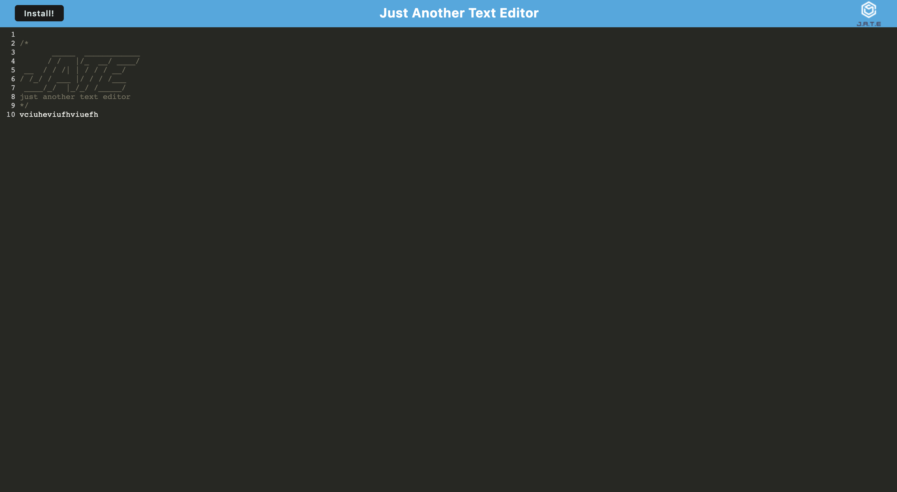

# miniature-pyscho-pump-the-app

## Description
Miniature Pyscho Pump The App gives users a basic text editor experience that rivals that of notepad 2.0 (except you can't really code in it) you can code in it without any of the worry of pesky helper bots and plugins bothering you or telling you your code is wrong. You can write simple notes to yourself to look book on wherever you go and best of all you can download it to your local storage so you have your nots always handy without the internet.

I think what I learned doing this application was most importantly be thorough when implementing PWA to an application, test everything to make sure its working both in testing and in prod.

## Installation

- To install Miniature Pyscho Pump The App  simply pull the SSH Link from the bright green code button in GitHub.
- Open up your terminal on your local machine and naviage to a directory you would like to store the code for this in type git clone then paste the SSH Link and hit enter.
- Once done you will have the full repo then it is just a matter of changing directories to Miniature Pyscho Pump The App   application and using your preffered method for opening it in a code editor.

## Usage

Either download or view the application online by going to our site address https://jate2023bb.herokuapp.com/ then simply get writing notes they will all be saved automatically

## License

MIT License

## Features

- Use the apllication online or offline in a browser

- Download it to your local machine so it lives on your desktop as an app with an icon

- Take notes, write code just dpon't do anything with rich text